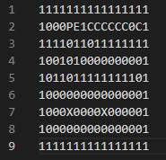

# 42_so_long

## About the project
The "so_long" project is a 2D top-down game written in C and using the 42-minilibx graphics library. The goal of the game is to control a skilled mage who must collect magic potions to open a portal and escape from a haunted castle before being hit by any goo monster.

The repository includes a Makefile that can be used to compile the source code and create the game executable. There is also a "maps" folder with valid maps that can be used with the program. To play the game, simply provide a ".ber" file address as an argument, which contains the structure of the map on which the game will be played. The map may include obstacles, hidden magic potions, and goo monsters lurking in every corner.

## Game rules
The player's goal is to collect all the potions on the map and then escape by choosing the shortest path without being intercepted by any slime (if there is any). The keys W, A, S and D should be used to move the main character and the ESC key ends the game. Good luck!!

## Making a ".ber" map
If you want create a customized ".ber" map, here are some rules to follow:

### The map can be composed of 6 different characters:
* '0' for an empty space
* '1' for a wall
* 'C' for a potion
* 'E' for an exit from the map
* 'P' for the initial position of the Mage
* 'X' for the initial position of a goo monster
* The ".ber" file must have a maximum of 9 lines and 16 characters per line.
* The map must contain at least 1 exit, 1 collectible and 1 initial position.
* The map must be rectangular.
* The map must be closed / surrounded by walls.

### How to run
* run "make"
* run "./so_long <map_path>"

### Here is an example of a valid map:

### Example of a game using the previous map:

